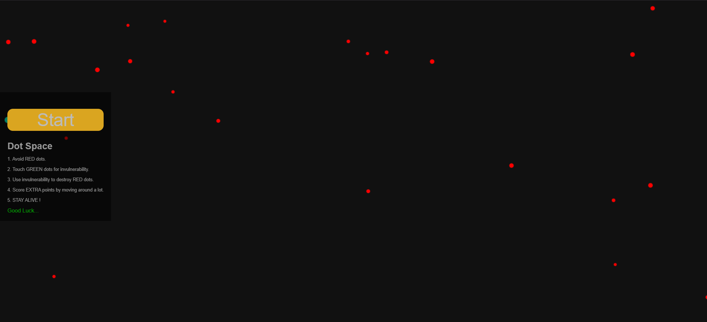

# Dot Space

A lightweight browser-based space survival game built with vanilla JavaScript and the HTML5 Canvas API.



## Overview

Dot Space is a real-time browser game where the player navigates a spacecraft through an increasingly difficult field of obstacles.

The game combines mouse and touch-based movement, collision detection, dynamic difficulty, power-ups, scoring, and particle effects into a self-contained web experience with no external frameworks or dependencies.

## Gameplay

The objective is to survive for as long as possible while avoiding incoming enemies.

* Red dots act as enemies and end the game on collision.
* Green dots provide temporary invulnerability.
* While invulnerable, enemies can be destroyed for additional points.
* The score increases through movement and survival.
* Enemy behavior and game difficulty increase as the game progresses.

## Key Features

* Real-time Canvas-based rendering
* Mouse and touch controls
* Collision detection
* Dynamic enemy generation
* Temporary invulnerability power-up
* Enemy destruction mechanics
* Particle effects
* Survival timer and scoring system
* Progressive difficulty
* Responsive game canvas
* No external libraries or frameworks

## Technologies

| Technology | Purpose                             |
| ---------- | ----------------------------------- |
| HTML5      | Application structure and interface |
| CSS3       | Styling and layout                  |
| JavaScript | Game logic and interactions         |
| Canvas API | Rendering the game environment      |

## Project Structure

```text
Space-Game/
│
├── index.html
├── style.css
├── script.js
├── screenshot-1.png
└── .gitattributes
```

### Core Files

**`index.html`**
Defines the game interface, canvas, score display, timer, and other UI elements.

**`style.css`**
Contains the visual styling and layout of the game interface.

**`script.js`**
Handles the game loop, player movement, enemy generation, collision detection, power-ups, scoring, particle effects, and difficulty progression.

## Game Architecture

The game operates around a continuous JavaScript game loop.

```text
User Input
    |
    v
Player Movement
    |
    v
Game State Update
    |
    +----> Enemy Movement
    |
    +----> Power-up Updates
    |
    +----> Collision Detection
    |
    +----> Score and Timer
    |
    v
Canvas Rendering
    |
    v
Next Frame
```

Each frame updates the current game state and renders the updated objects onto the canvas.

## Running Locally

No package installation or build process is required.

### Clone the repository

```bash
git clone https://github.com/dipesh-gir-i/Space-Game.git
```

### Navigate to the project

```bash
cd Space-Game
```

### Run the game

Open `index.html` directly in a web browser.

For development, the project can also be served using a local development server such as VS Code Live Server.

## Browser Support

The game uses standard HTML5, CSS3, JavaScript, and Canvas APIs and is intended to run in modern web browsers.

## Learning Outcomes

This project provided hands-on experience with:

* JavaScript game loops
* Canvas-based rendering
* Event-driven user interaction
* Mouse and touch input
* Collision detection
* Real-time state management
* Object-oriented programming concepts
* Procedural enemy generation
* Particle systems
* Responsive browser-based applications

## Future Improvements

Potential improvements include:

* Persistent high scores using local storage
* Additional enemy types
* More power-up variations
* Sound effects and background music
* Improved mobile controls
* Additional game modes
* More advanced visual effects
* Difficulty and gameplay settings

## Author

**Dipesh**

Built as a frontend development project.

## License

This project is available for educational and personal use.
